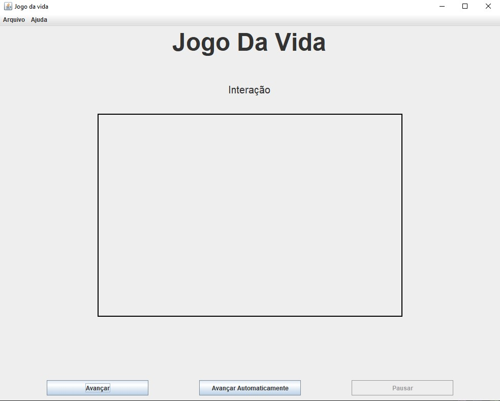

<h1 align="center">Jogo da Vida de Conway</h1>

<h2>Feito por <a href="https://github.com/JoaoVitorDomingos">João Vitor C. Domingos</a> e <a href="https://github.com/Kauann8">Kauan Gomes</a></h2>
<h2>Instalação</h2>

É necessário ter o JDK 24 instalado em sua máquina para poder rodar o projeto, <a href="https://download.oracle.com/java/24/latest/jdk-24_windows-x64_bin.exe" target="_blank">baixe aqui</a>

Baixe o executável do programa <CODE>(.jar)</CODE> <a href="https://github.com/Carona-Software-Business/Trabalho-POO/releases/tag/1.0.0">aqui</a>. E com dois cliques, execute-o.

Junto com o executável há uma pasta com alguns tabuleiros já prontos, apenas abra-os no programa.

